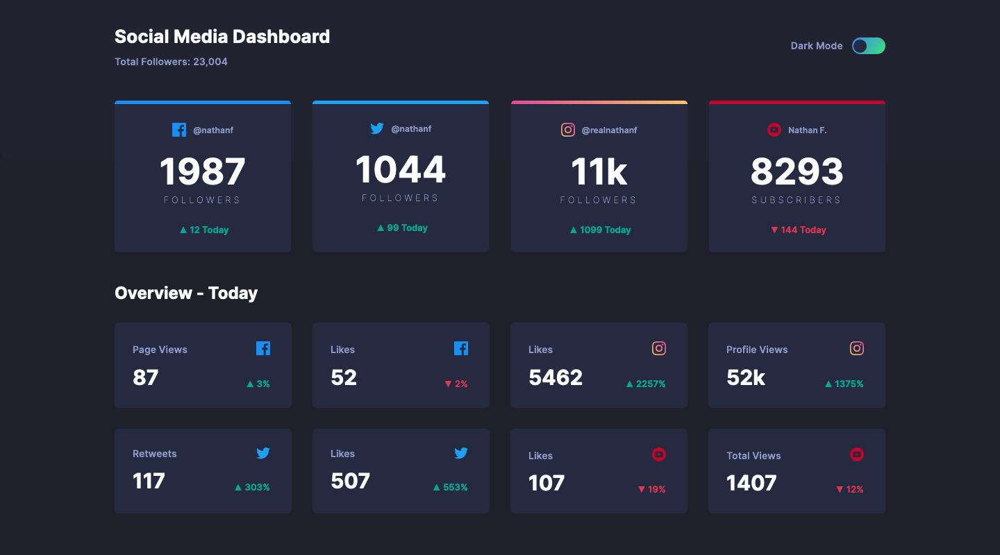

# Frontend Mentor - Social media dashboard with theme switcher solution
## Welcome! 👋

This is a solution to the [Social media dashboard with theme switcher challenge on Frontend Mentor](https://www.frontendmentor.io/challenges/social-media-dashboard-with-theme-switcher-6oY8ozp_H). Frontend Mentor challenges help you improve your coding skills by building realistic projects. 

## Table of contents

- [Overview](#overview)
  - [The challenge](#the-challenge)
  - [Screenshot](#screenshot)
  - [Links](#links)
- [My process](#my-process)
  - [Built with](#built-with)
  - [What I learned](#what-i-learned)
  - [Continued development](#continued-development)
  - [Useful resources](#useful-resources)
- [Author](#author)
- [Acknowledgments](#acknowledgments)

## Overview

### The challenge

Users should be able to:

- View the optimal layout for the site depending on their device's screen size
- See hover states for all interactive elements on the page
- Toggle color theme to their preference

### Screenshot

### Links

- Solution URL: [Github](https://github.com/aycanogut/fem-social-media-dashboard)
- Live Site URL: [Vercel](https://fem-social-media-dashboard-fawn.vercel.app/)

### Built with

- [Semantic HTML5 markup](https://developer.mozilla.org/en-US/docs/Glossary/Semantics#semantics_in_html)
- [CSS custom properties](https://developer.mozilla.org/en-US/docs/Web/CSS/--*)
- [SASS](https://sass-guidelin.es/)
- [CSS Flexbox](https://css-tricks.com/snippets/css/a-guide-to-flexbox/)
- [gulp.js](https://gulpjs.com/)
- [Javascript](https://javascript.info/)
- [Mobile-first workflow](https://bradfrost.com/blog/post/mobile-first-responsive-web-design/)

### What I learned

I learned how to make an accessibility-friendly toggle button and how to use custom CSS variables to enable dark mode functionality. 
### Useful resources

- [Accessible Option for Toggle Switch](https://codepen.io/SaraSoueidan/pen/jpBbrq?editors=0100) - That solution allowed me to see how I can build an accessible toggle button. 
- [Coder Coder](https://www.youtube.com/watch?v=n3hkpnOFr0A&list=PLUWqFDiirlsu5az5EIyxe8ZddyNO_kDuP&index=3) - I learned gulp.js configurations from this source.
- [How to create a dark theme system in 5 minutes or less with vanilla JS. ](https://dev.to/codedgar/how-to-create-a-dark-theme-system-in-5-minutes-or-less-with-vanilla-js-2922) - I learnt how to modify the state of the page theme using CSS custom variables. 
## Author

- [Github](https://github.com/aycanogut)
- [LinkedIn](https://www.linkedin.com/in/aycanogut/)
- [Medium](https://medium.com/@aycanogut)
- [Frontend Mentor](https://www.frontendmentor.io/profile/bleedeleventh)
- [CodePen](https://codepen.io/aycanogutt)